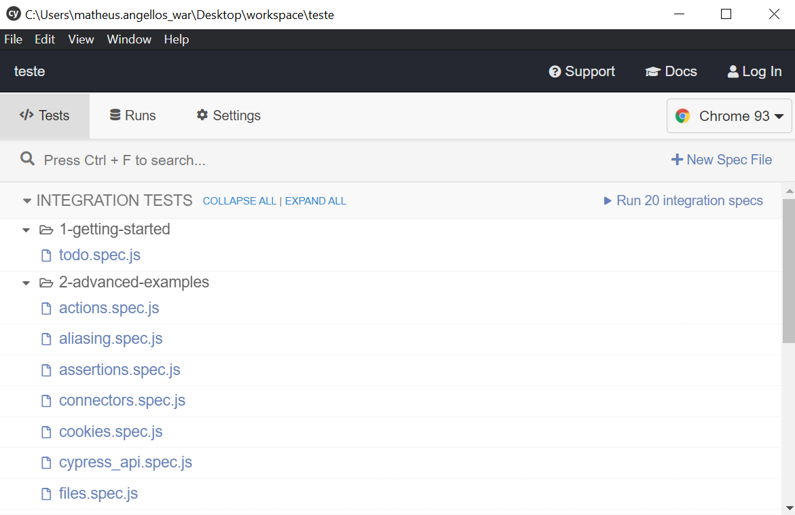

# Cypress

Created: August 30, 2021 3:13 PM

## O que é?

**Cypress** é uma ferramenta poderosa de última geração desenvolvida especialmente para engenheiros de controle de qualidade (analistas QA) e desenvolvedores, que podem usá-la para os testes unitários e E2E. Totalmente baseado em uma nova arquitetura isenta do Selenium, apresenta o próprio painel exibindo exatamente o que está acontecendo durante a execução dos testes. À medida que o script é escrito é possível acompanhar como será a execução do teste através desse painel, auxiliando o técnico em quais partes precisam de ajustes no teste.

O Cypress utiliza o **Node JS** como servidor e interpretador de sua linguagem **JavaScript**. Trabalhando juntos, cypress e Node JS estão em constante sincronização e comunicação para execução de tarefas, tornando a experiência da escrita e execução dos testes muito mais ágil, já que o Cypress também opera na camada de rede, na leitura e alteração de tráfego na web em tempo real.

Cypress contém uma completa documentação disponível em [cypress.io](http://cypress.io) que facilita a escrita dos testes tornando-os mais confiáveis, com dicas e exemplos que podem ser aplicados sem haver necessidade de perder tempo na busca pela web já que todo conteúdo se encontra concentrado nesse site.

---

## Por que é utilizado?

Seu principal foco é o teste E2E. Dentre uma gama extensa de ferramentas que utilizam o Selenium para automatização de testes, operando-os fora do navegador e executando os comandos remotamente pela rede, o Cypress surge para criar uma nova forma de automatizar os testes. Ele executa todos os testes no mesmo ciclo de execução do sistema que está sendo testado, sem usar o controle remoto que o Selenium utiliza para acesso ao sistema. Seu principal diferencial é ter sido desenvolvido para que os testes aconteçam simultaneamente ao desenvolvimento da aplicação. Claro que depende muito do processo utilizado no desenvolvimento, mas o Cypress sendo simples contribui com o aumento de produtividade no quesito de escrita de testes e aumenta a qualidade do sistema final.

Há possibilidade de criar testes apenas de front-end e back-end, não só testes E2E. Como ele tem o controle nativo da aplicação controlando-a de cima para baixo, além de operar dentro da camada de rede, lendo e alterando o tráfego da web em tempo real.

Os logs de comandos são gravados para revisitar posteriormente os resultados. Eles são exibidos em tempo de execução dos testes, à medida que os testes são escritos e salvos o Cypress já executa a automação para que o técnico possa verificar se o que foi codado está aderente ao teste, facilitando e muito no debug da automação.

Captura de tela para testes falhos e gravação de vídeos de toda execução dos testes, sem configurações extras uma vez que o Cypress tem acesso nativo ao SO uma vez que ele todo é instalado localmente na máquina, e não utilizado de forma remota, além de possibilitar criação de relatórios de testes de forma mais simples que o Selenium.

---

## Como funciona?

Cypress tem controle e acesso nativo a toda aplicação, e com esse recurso torna o teste muito mais rápido e confiável para quem está automatizando. Isso possibilita a criação dos casos de teste automatizados de forma simultânea com o próprio desenvolvimento da aplicação. O Cypress controla a aplicação de cima para baixo, onde assim interpreta o que ocorre fora e dentro do navegador que está sendo testado, fornece ndo resultados muito mais consistentes do que o Selenium, por conta de a ferramenta ser capaz de compreender os eventos assim que eles acontecem . Além de operar dentro da camada de rede, a ferramenta interpreta e altera o tráfego da web em tempo real.

### Instalação

📃 **Pré-requisitos:**

- Node.js ([https://nodejs.org/en/download/](https://nodejs.org/en/download/))
- Alguma IDE de sua preferência ([https://code.visualstudio.com/download](https://code.visualstudio.com/download))

Basta então acessar o terminal e executar o seguinte comando:

```bash
npm install cypress
```

Para executar é só passar o comando abaixo via terminal.

```bash
./node_modules/.bin/cypress open
```

Será aberta uma nova janela com alguns códigos de exemplo:



Será criada uma estrutura de pastas padrão, onde a pasta **Integration** é onde ficam os testes, que possuem a extensão `.spec.js`:


Ao executar qualquer teste, é exibida a interface do Cypress, mostrando passo a passo tudo que é executado:


---

## Referências

- [https://www.cypress.io/](https://www.cypress.io/)
- [https://atech.com.br/cypress-o-novo-conceito-em-testes-automatizados/](https://atech.com.br/cypress-o-novo-conceito-em-testes-automatizados/)
