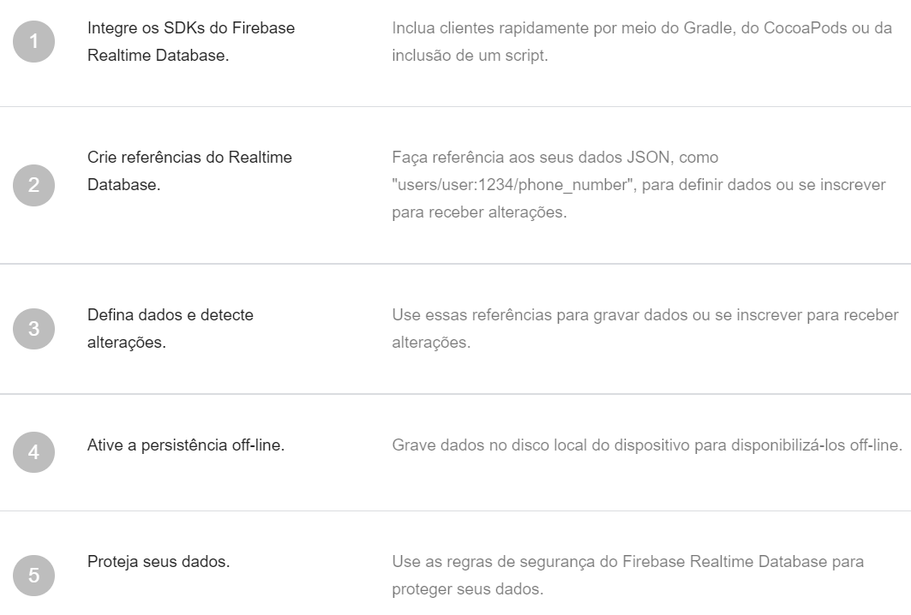

# Firebase Realtime Database

Created: September 5, 2021 10:27 AM

## O que é?

O **Firebase Realtime Database** é um banco de dados hospedado na nuvem. Os dados são armazenados como JSON e sincronizados em tempo real com todos os clientes conectados. Quando você cria apps multiplataforma com os SDKs do Google para iOS, Android e JavaScript, todos os clientes compartilham uma instância do Realtime Database e recebem automaticamente atualizações com os dados mais recentes.

---

## Como funciona?

Nele é possível criar aplicativos avançados e colaborativos, ao conceder acesso seguro ao banco de dados diretamente do código do cliente. Os dados são mantidos localmente e, mesmo off-line, os eventos em tempo real continuam sendo acionados, proporcionando uma experiência responsiva ao usuário final. Quando o dispositivo recupera a conexão, o Realtime Database sincroniza as alterações feitas nos dados locais com as atualizações remotas que ocorreram enquanto o cliente estava off-line, mesclando qualquer conflito automaticamente.

Fornece uma linguagem de regras flexíveis baseadas em expressão, denominadas regras de segurança, para definir como os dados são estruturados e quando podem ser lidos e gravados. Por meio da integração com o Firebase Authentication, os desenvolvedores podem definir quem tem acesso, a quais dados e como esses dados podem ser acessados.

Ele é um banco de dados NoSQL e, por isso, tem otimizações e funcionalidades diferentes de um banco de dados relacional. A API foi desenvolvida para autorizar apenas operações que possam ser executadas com rapidez. Isso possibilita uma ótima experiência em tempo real que atende a milhões de usuários sem comprometer a capacidade de resposta. Por isso, é importante analisar como os usuários precisam acessar os dados e [estruturá-los adequadamente](https://firebase.google.com/docs/database/web/structure-data?hl=pt-br).

---

## Principais recursos

- **Em tempo real:** Em vez de solicitações HTTP típicas, usa a sincronização de dados. Sempre que os dados são alterados, todos os dispositivos conectados recebem essa atualização em milissegundos. Crie experiências colaborativas e imersivas sem se preocupar com códigos de rede.
- **Off-line:** Os apps do Firebase permanecem responsivos mesmo off-line, pois o SDK do Firebase Realtime Database mantém seus dados em disco. Quando a conectividade é restabelecida, o dispositivo cliente recebe as alterações perdidas e faz a sincronização com o estado atual do servidor.
- **Acessível em dispositivos clientes:** Pode ser acessado diretamente de um dispositivo móvel ou navegador da Web, sem um servidor de aplicativos. A segurança e a validação de dados estão disponíveis por meio de regras de segurança baseadas em expressão do Firebase Realtime Database, executadas quando os dados são lidos ou gravados.
- **Escalonar entre vários bancos de dados:** No plano de preços do Blaze, você pode oferecer suporte em grande escala às necessidades de dados do seu app. Para isso, você pode dividir seus dados entre várias instâncias de banco de dados no mesmo projeto do Firebase. Simplifique a autenticação no seu projeto com o Firebase Authentication e autentique usuários nas suas instâncias de banco de dados. Controle o acesso às informações em cada banco de dados com regras personalizadas do Firebase Realtime Database para cada instância de banco de dados

---

## Funcionalidades no desenvolvimento

São diferentes serviços e com diversas utilidades:

- **real time data base**: nos ajuda dando uma base de dados em tempo real;
- **autenticação:** se executa para identificar os usuários por meio do e-mail ou das redes sociais;
- **nuvem de armazenamento:** armazenamento e envio de arquivos à escala de Google;
- **hosting:** se utiliza para publicar nosso site;
- **remote config:** é utilizado para modificar alguns aspectos do nosso app sem a necessidade de atualizá-lo;
- **test lab:** serve para testar o aplicativo antes de publicá-lo;
- **crash reporting:** se utiliza para reportar erros do aplicativo.

---

## Caminho de implementação

---

## Referências

- [https://firebase.google.com/docs/database?hl=pt-br](https://firebase.google.com/docs/database?hl=pt-br)
